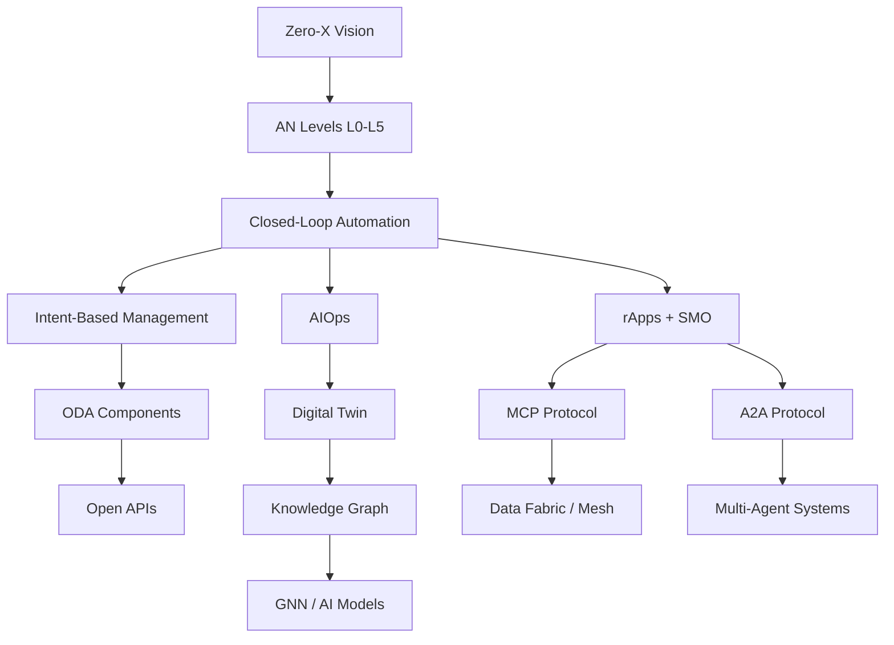

# Knowledge Base — Concepts & Definitions

Foundational concepts, frameworks, and definitions referenced across this project. These are not tied to a specific event or use case — they are the building blocks for understanding the industry.

---

## Documents

| # | Topic | One-Line Summary |
|---|-------|-----------------|
| 01 | [Zero-X](./01-Zero-X.md) | Zero Wait + Zero Touch + Zero Trouble — the target experience |
| 02 | [Autonomous Networks Levels (L0–L5)](./02-Autonomous-Networks-Levels.md) | Six levels from manual to fully autonomous |
| 03 | [Closed-Loop Automation](./03-Closed-Loop-Automation.md) | Observe → Analyze → Decide → Act → Verify cycle |
| 04 | [Intent-Based Management](./04-Intent-Based-Management.md) | Declare what you want, not how to do it |
| 05 | [Digital Twin](./05-Digital-Twin.md) | Real-time virtual replica of the network |
| 06 | [Open Digital Architecture (ODA)](./06-Open-Digital-Architecture-ODA.md) | TM Forum's blueprint for modular, cloud-native telco IT |
| 07 | [Knowledge Graph](./07-Knowledge-Graph.md) | Network as nodes and edges — topology-aware AI |
| 08 | [rApps and SMO](./08-rApps-and-SMO.md) | RAN automation apps on O-RAN's orchestration platform |
| 09 | [MCP and A2A Protocols](./09-MCP-and-A2A-Protocols.md) | Standardized agent-to-data and agent-to-agent communication |
| 10 | [AIOps](./10-AIOps.md) | AI for operations — anomaly detection, RCA, remediation |
| 11 | [CFS, RFS, Catalogs & Inventories](./11-CFS-RFS-Catalog-Inventory.md) | Product → Service → Resource model, catalogs vs. inventories |
| 12 | [SID — Information Framework](./12-SID-Information-Framework.md) | TM Forum's common data model and vocabulary (the ontology) |
| 13 | [One View, All Layers](./13-One-View-All-Layers.md) | How SID, ODA, CFS, RFS, Catalog, Inventory & Digital Twin fit together |
| 14 | [SID in Practice — Examples](./14-SID-Examples.md) | Concrete JSON examples of SID entities (Service, Resource, Catalog) |

---

## How They Connect

---

## When to Add Here

Add a document to this folder when:
- It defines a concept or framework used across multiple other documents
- It's educational/theoretical rather than event-specific or deployment-specific
- It helps someone new to the topic understand the fundamentals

Do NOT add here:
- Event-specific content (goes in `dtw-ignite-prep/`)
- Specific operator deployments (goes in `use-cases/`)
- Telecom Argentina-specific content (goes in `our-cases/`)
