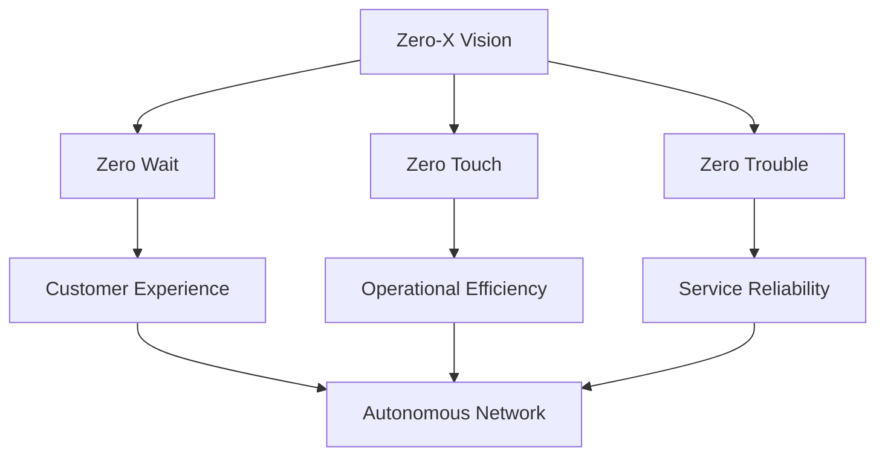

# Zero-X — Zero Wait, Zero Touch, Zero Trouble

## Definition

Zero-X is TM Forum's guiding vision for the end-state of Autonomous Networks. It describes the experience that CSPs should deliver to customers and internal operations once full network autonomy is achieved.

**"Zero-X" = Zero Wait + Zero Touch + Zero Trouble**

The concept frames autonomy not as a technology goal but as a **customer experience outcome**: simplicity for users, complexity hidden behind the scenes.

> "AN will enable CSPs to deliver a 'Zero-X' (zero wait, zero touch, zero trouble) experience — deliver simplicity to the users and leave complexity with the providers."
> — TM Forum, Autonomous Networks Project

---

## The Three Pillars

### Zero Wait

| Aspect | Detail |
|--------|--------|
| **Definition** | Customers get what they need quickly and efficiently, eliminating wait times |
| **Focus** | Speed of service delivery and fulfillment |
| **Goal** | Instant or near-instant response to customer requests |
| **Examples** | Instant service activation, real-time upgrades, on-demand bandwidth, immediate provisioning |
| **Enablers** | Intent-based orchestration, automated fulfillment, pre-provisioned resources |

**Practical example:** A customer requests a temporary bandwidth upgrade for a video conference. Instead of waiting hours or days for manual provisioning, the network delivers it in seconds through automated intent-based orchestration.

---

### Zero Touch

| Aspect | Detail |
|--------|--------|
| **Definition** | Automating tasks or processes requiring minimal or no human effort to operate |
| **Focus** | Operational efficiency and elimination of manual intervention |
| **Goal** | Network operates, heals, and optimizes without human hands |
| **Examples** | Zero Touch Provisioning, automated configuration, self-optimization, parallel task execution |
| **Enablers** | Closed-loop automation, AI/ML decision-making, agentic AI, rApps |

**Practical example:** A new cell site is deployed. Instead of engineers manually configuring parameters, the network auto-discovers the site, applies optimal configuration based on surrounding topology, and integrates it into the live network — all without human intervention.

---

### Zero Trouble

| Aspect | Detail |
|--------|--------|
| **Definition** | Automatically responding to any inconvenience or customer frustration before or as it occurs |
| **Focus** | Proactive problem resolution and customer experience protection |
| **Goal** | No customer-impacting faults; problems resolved before users notice |
| **Examples** | Predictive self-healing, proactive fault resolution, AI-driven anomaly prevention |
| **Enablers** | Predictive analytics, digital twins, GNN-based root cause analysis, self-healing agents |

**Practical example:** AI detects early signs of fiber degradation on a link serving 500 customers. Before any service impact occurs, the network automatically reroutes traffic to a redundant path and schedules maintenance — the customer never experiences a problem.

---

## Zero-X as a Navigation Compass

The Zero-X pillars are not separate initiatives — they are **interconnected principles** that guide decision-making at every level of the AN journey:

### Why "Compass"?

When facing transformation decisions, Zero-X helps prioritize:
- **Which use case to automate first?** The one that most reduces wait, touch, or trouble.
- **How to measure success?** Against zero — any remaining wait, touch, or trouble is a gap.
- **Where to invest?** Where the distance from zero is greatest.

---

## Relationship to AN Levels

| AN Level | Zero Wait | Zero Touch | Zero Trouble |
|----------|-----------|------------|--------------|
| L0 (Manual) | Long waits | All manual | Reactive only |
| L1 (Assisted) | Reduced waits | Some automation | Faster detection |
| L2 (Partial) | Shorter fulfillment | Partial automation | Some proactive |
| L3 (Conditional) | Near-real-time | Domain automation | Predictive in domains |
| L4 (Highly Autonomous) | Near-instant | Minimal human touch | Proactive cross-domain |
| L5 (Fully Autonomous) | **Zero** | **Zero** | **Zero** |

Zero-X is fully achieved at **Level 5**. Level 4 gets close within specific domains.

---

## Business Impact

TM Forum research quantifies the value of progressing toward Zero-X:

| Metric | Improvement |
|--------|-------------|
| Operations & maintenance costs | Up to 55% reduction |
| Customer satisfaction | Up to 71% increase |
| Energy savings | Up to 21% improvement |

---

## Who Coined It

Zero-X emerged from TM Forum's Autonomous Networks Project, first formalized in the **IG1218 Autonomous Networks Business Requirements and Framework** document. It has been a core concept since at least 2022 and is referenced across all AN-related TM Forum publications.

The article "Zero as a Navigation Compass" (September 2023) by **Matias Lambert, CEO of Iquall Networks** (an Argentine company and AN Manifesto signatory), provides one of the clearest explanations of how to use Zero-X as a practical decision-making framework.

---

## Related Concepts

| Concept | Relationship to Zero-X |
|---------|----------------------|
| [[03-Autonomous-Networks|Autonomous Networks Levels (L0-L5)]] | Zero-X is the target state; AN Levels measure progress toward it |
| [[04-TM-Forum-Level4-Certification|Closed-Loop Automation]] | The mechanism that enables Zero Touch and Zero Trouble |
| [[07-Data-Model-CFS-RFS-Catalog-for-AN|Intent-Based Management]] | Enables Zero Wait by translating business intent to instant action |
| [[04-Agentic-AI-in-Telco|Agentic AI]] | AI agents are the workforce that delivers Zero-X at scale |
| Self-Healing Networks | Direct implementation of Zero Trouble |
| Zero Touch Provisioning (ZTP) | Specific implementation of Zero Touch for device onboarding |

---

## TM Forum Documents

| ID | Title | Relevance |
|----|-------|-----------|
| IG1218 | Autonomous Networks Business Requirements and Framework v3.0 | Defines Zero-X as part of AN business requirements |
| GB1042 | Autonomous Operations Maturity Model v1.0 | Measures progress toward zero-touch operations |
| IG1230 | Autonomous Networks Technical Architecture | Architecture enabling Zero-X |

---

## Sources
- [TM Forum: Autonomous Networks Project](https://www.tmforum.org/autonomous-networks-project/) — Zero-X definition
- [TM Forum: Autonomous Networks Mission](https://www.tmforum.org/missions/autonomous-networks/) — Zero-X in mission context
- [TM Forum Inform: "Zero as a Navigation Compass"](https://inform.tmforum.org/features-and-opinion/zero-as-a-navigation-compass) — Matias Lambert, Iquall Networks (Sep 2023)
- [TM Forum: AN Topics](https://www.tmforum.org/topics/autonomous-networks/) — "seamless, zero-wait, zero-touch, and zero-trouble experience"
- [TM Forum: Zero-Touch Operations and Automation](https://www.tmforum.org/themes-autonomous-operations/)
- [TM Forum: Autonomous Networks Empowering Digital Transformation](https://inform.tmforum.org/research-and-analysis/reports/autonomous-networks-empowering-digital-transformation-for-smart-societies-and-industries)
