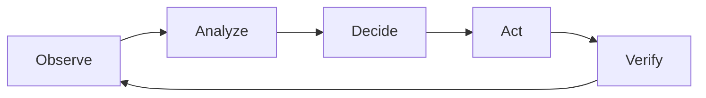

# Closed-Loop Automation

## Definition

Closed-loop automation is a continuous cycle where the system observes the network, analyzes what it sees, decides what to do, acts on that decision, and verifies the result — all without human intervention. It's the operational mechanism that makes autonomous networks possible.

---

## The Cycle

| Phase | What Happens | Example |
|-------|-------------|---------|
| **Observe** | Collect data from network (telemetry, alarms, KPIs) | Latency spike detected on 50 cells |
| **Analyze** | AI/ML processes data, identifies root cause | GNN traces fault to a fiber degradation |
| **Decide** | System determines optimal action | Reroute traffic to redundant path |
| **Act** | Execute the change on the network | Configuration pushed via SMO/EIAP |
| **Verify** | Confirm the action resolved the issue | KPIs return to normal, no customer impact |

If verification fails, the loop restarts with new observations.

---

## Open Loop vs. Closed Loop

| Aspect | Open Loop | Closed Loop |
|--------|-----------|-------------|
| Human role | Human decides and acts | System decides and acts |
| Feedback | No automatic verification | Automatic verification |
| Speed | Minutes to hours | Seconds to minutes |
| Scale | Limited by human capacity | Scales with compute |
| AN Level | L1–L2 | L3–L5 |

---

## Types of Closed Loops

| Type | Scope | Speed | Example |
|------|-------|-------|---------|
| **Resource loop** | Single device/element | Milliseconds–seconds | Power saving on a cell |
| **Domain loop** | Within one domain (RAN, transport) | Seconds–minutes | RAN parameter optimization |
| **Cross-domain loop** | Across multiple domains | Minutes | End-to-end service healing |
| **Business loop** | Business intent to network action | Minutes–hours | SLA violation → capacity expansion |

---

## Relationship to Other Concepts

| Concept | How It Relates |
|---------|---------------|
| [[01-Zero-X|Zero-X]] | Closed-loop is what delivers Zero Touch and Zero Trouble |
| [[02-Autonomous-Networks-Levels|AN Levels]] | L3+ requires closed-loop; L4/L5 require cross-domain loops |
| [[04-Intent-Based-Management|Intent-Based Management]] | Intent defines the "what"; closed-loop delivers the "how" |
| [[04-Agentic-AI-in-Telco|Agentic AI]] | AI agents are the decision-makers inside the loop |
| [[06-rApps-and-SMO|rApps]] | rApps implement closed-loops for RAN optimization |

---

## Sources
- [TM Forum: Autonomous Networks Technical Architecture (IG1230)](https://www.tmforum.org/resources/reference/ig1230-autonomous-networks-technical-architecture-v1-1-1/)
- [TM Forum: Autonomous Network Hyperloops](https://www.tmforum.org/autonomous-network-hyperloops/)
- [TM Forum: GB1042 Autonomous Operations Maturity Model](https://www.tmforum.org/resources/guidebook/gb1042-autonomous-operations-maturity-model-v1-0-0/)
