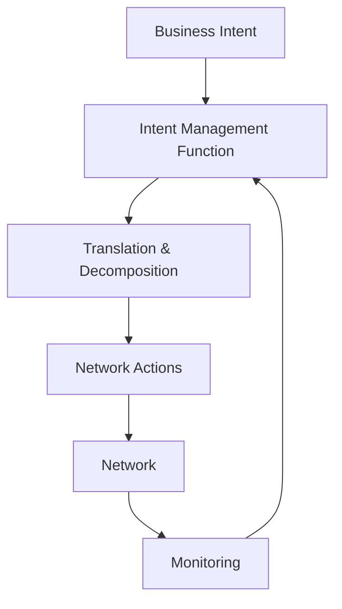

# Intent-Based Management

## Definition

Intent-based management is a declarative approach where you tell the network **what you want** (the desired outcome) rather than **how to do it** (specific configurations). The system translates business intent into network actions autonomously.

---

## How It Works

| Layer | Example |
|-------|---------|
| **Business intent** | "Ensure 99.99% availability for enterprise customer X" |
| **Service intent** | "Maintain dual-path redundancy with <10ms failover" |
| **Network intent** | "Configure ECMP on routers A, B, C with BFD timers at 50ms" |
| **Resource intent** | "Allocate 10Gbps on links 1 and 2, reserve 5Gbps backup on link 3" |

The system handles all the decomposition — the operator only declares the top-level intent.

---

## Intent vs. Imperative

| Aspect | Imperative (Traditional) | Intent-Based |
|--------|--------------------------|--------------|
| What you specify | Exact commands and configs | Desired outcome |
| Who decides how | Human engineer | AI/system |
| Adaptability | Static until changed manually | Self-adapts to maintain intent |
| Scale | Doesn't scale (human bottleneck) | Scales with automation |
| Example | "Set bandwidth to 100Mbps on port Gi0/1" | "Ensure customer gets 100Mbps" |

---

## Key Components

### Intent Management Function (IMF)
- Receives and validates intents
- Decomposes high-level intents into actionable sub-intents
- Monitors fulfillment and triggers corrections
- Part of TM Forum's AN architecture

### Intent Lifecycle
1. **Define** — Express desired outcome in business terms
2. **Translate** — Decompose into domain-specific actions
3. **Activate** — Execute on the network
4. **Assure** — Continuously verify intent is being met
5. **Adapt** — Modify actions if conditions change

---

## Role in Autonomous Networks

| AN Level | Intent Role |
|----------|-------------|
| L1–L2 | No intent; humans specify exact actions |
| L3 | Intent within a single domain |
| L4 | Cross-domain intent orchestration |
| L5 | Business-level intent drives everything |

Intent-based management is what enables [[01-Zero-X|Zero Wait]] — customers express what they need, and the network delivers instantly without manual translation.

---

## Practical Examples

| Scenario | Intent | System Does |
|----------|--------|-------------|
| New enterprise service | "Provide 1Gbps MPLS VPN between 3 sites with 99.9% SLA" | Designs topology, provisions resources, configures QoS, sets up monitoring |
| Energy optimization | "Minimize energy during off-peak without degrading experience" | Identifies low-traffic cells, activates sleep modes, monitors KPIs |
| Fault response | "Maintain service continuity for premium customers" | Detects fault, reroutes traffic, prioritizes premium SLAs |
| Capacity planning | "Ensure no cell exceeds 80% utilization in next 30 days" | Forecasts demand, identifies hotspots, provisions capacity |

---

## TM Forum Standards

| Document | Relevance |
|----------|-----------|
| IG1230 | AN Technical Architecture — defines intent interfaces |
| IG1339 | AN L4 High Value Scenarios — intent-driven use cases |
| TMF921 | Intent Management API (emerging) |

---

## Sources
- [TM Forum: Autonomous Networks Technical Architecture](https://www.tmforum.org/resources/reference/ig1230-autonomous-networks-technical-architecture-v1-1-1/)
- [TM Forum: Operationalizing Intent-Based Autonomy at Level 4+](https://inform.tmforum.org/research-and-analysis/proofs-of-concept/operationalizing-intent-based-autonomy-at-level-4)
- [TM Forum: AN L4 High Value Scenarios (IG1339)](https://www.tmforum.org/resources/introductory-guide/ig1339-autonomous-networks-l4-high-value-scenarios-v2-0-0/)
