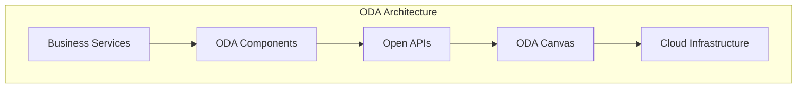

# Open Digital Architecture (ODA)

## Definition

ODA is TM Forum's blueprint for building flexible, cloud-native telecom IT systems. It defines standardized, interoperable software components organized into loosely coupled domains, exposing business services through Open APIs built on a common data model.

---

## Core Principles

| Principle | Meaning |
|-----------|---------|
| **Component-based** | Plug-and-play software building blocks |
| **Cloud-native** | Designed for containerized, scalable deployment |
| **API-first** | All functionality exposed via standardized Open APIs |
| **Model-driven** | Based on SID data model and eTOM processes |
| **Vendor-neutral** | Any vendor's component can interoperate |
| **Intent-ready** | Evolving toward agentic, AI-driven components |

---

## ODA Layers

| Layer | What It Is |
|-------|-----------|
| **ODA Components** | Reusable software blocks performing IT/network functions |
| **Open APIs** | 60+ REST APIs for standardized interaction (TMF620, TMF638, etc.) |
| **ODA Canvas** | Runtime environment that orchestrates components (Kubernetes-based) |
| **SID** | Information Framework — common data model and vocabulary |
| **eTOM** | Process Framework — standard business processes |

---

## Key Elements

### ODA Components
- Self-contained software units with defined boundaries
- Expose functionality through Open APIs
- Can be from any vendor (interoperable)
- Mapped to eTOM process areas
- Examples: Product Catalog (TMFC001), Service Inventory (TMFC008), Resource Inventory (TMFC012)

### Open APIs (60+)
| API | Purpose |
|-----|---------|
| TMF620 | Product Catalog Management |
| TMF633 | Service Catalog Management |
| TMF637 | Product Inventory |
| TMF638 | Service Inventory |
| TMF639 | Resource Inventory |
| TMF641 | Service Order Management |
| TMF645 | Service Qualification |
| TMF652 | Resource Order Management |

### ODA Canvas
- Cloud-native runtime (typically Kubernetes)
- Manages component lifecycle
- Handles security, observability, API gateway
- Enables zero-touch interoperability

---

## Agentic ODA (2025–2026 Evolution)

ODA is evolving so each component can function as an **independent AI-enabled agent**:

- Components communicate with each other autonomously
- Cross-system, cross-channel, cross-domain operation
- RAG (Retrieval-Augmented Generation) capabilities within components
- Intent-based interaction between components
- See: [[04-Agentic-AI-in-Telco|Agentic AI in Telco]]

---

## ODA Conformance

TM Forum offers conformance certification for vendors implementing Open APIs in commercial products. This verifies interoperability and standards compliance.

---

## Relationship to Other Concepts

| Concept | Connection |
|---------|-----------|
| [[07-Data-Model-CFS-RFS-Catalog-for-AN|CFS/RFS/Catalog]] | ODA Components manage catalogs and inventories |
| [[02-Autonomous-Networks-Levels|AN Levels]] | ODA provides the IT architecture for autonomous operations |
| [[04-Intent-Based-Management|Intent-Based Management]] | ODA components interpret and fulfill intents |
| [[01-Zero-X|Zero Touch]] | ODA enables plug-and-play, reducing manual integration |

---

## Sources
- [TM Forum: About ODA](https://www.tmforum.org/oda/)
- [TM Forum: ODA Technical Architecture & Components](https://www.tmforum.org/oda/implementation/technical-architecture-components/)
- [TM Forum: ODA Canvas](https://www.tmforum.org/oda/deployment-runtime/oda-canvas/)
- [TM Forum: Open APIs Directory](https://www.tmforum.org/oda/open-apis/)
- [TM Forum: ODA Toolkit](https://www.tmforum.org/resources/standard/open-digital-architecture-toolkit/)
