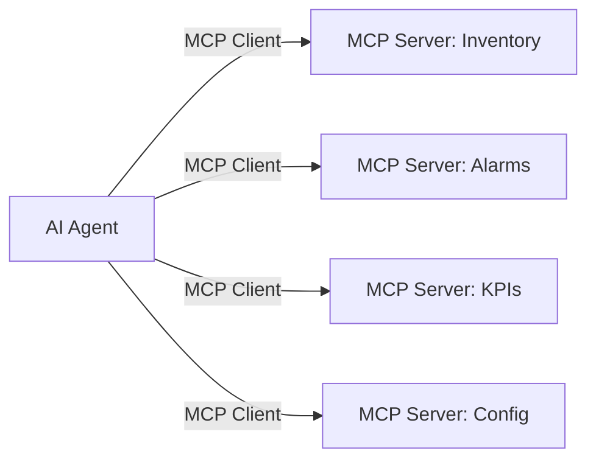
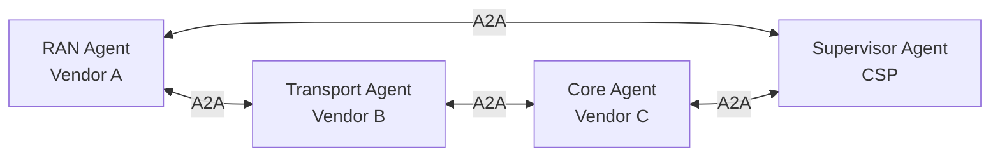

# MCP and A2A Protocols

## Why These Matter

Traditional telco integration means building custom connectors between every pair of systems (N x N problem). MCP and A2A are standardized protocols that let AI agents access data and communicate with each other through a common interface — replacing spaghetti integrations with a uniform layer.

---

## MCP — Model Context Protocol

| Aspect | Detail |
|--------|--------|
| **What** | Open protocol for AI applications to access external data sources and tools |
| **Created by** | Anthropic (open standard) |
| **Adopted by** | AWS, Ericsson, Google, and others |
| **Purpose** | Standardized way for AI agents to discover and use data/tools |
| **Architecture** | Client-server (AI agent = client, data source = MCP server) |

### How MCP Works

Each data source exposes an MCP server. Any AI agent can connect to any server using the same protocol. No custom integration needed.

### Telco Use Cases for MCP
- Agent queries network inventory without custom API code
- Agent accesses alarm data from any vendor's NMS
- Agent reads/writes configurations through standardized interface
- Ericsson rApp aaS exposes insights via MCP for CSP integration
- AWS Semantic MCP Server: edge SLMs filter data before sending to cloud

---

## A2A — Agent-to-Agent Protocol

| Aspect | Detail |
|--------|--------|
| **What** | Protocol for AI agents to communicate and collaborate with each other |
| **Created by** | Google (open standard) |
| **Adopted by** | Ericsson, AWS, and others |
| **Purpose** | Enable multi-vendor agent ecosystems to interoperate |
| **Architecture** | Peer-to-peer agent communication |

### How A2A Works

Agents from different vendors can discover each other, negotiate capabilities, delegate tasks, and share results — without being from the same platform.

### Telco Use Cases for A2A
- RAN optimization agent coordinates with transport agent for end-to-end SLA
- Fault agent from vendor A asks capacity agent from vendor B for rerouting options
- CSP's supervisor agent orchestrates specialized agents from multiple vendors
- Cross-domain closed-loop automation without vendor lock-in

---

## MCP vs. A2A

| Aspect | MCP | A2A |
|--------|-----|-----|
| **Purpose** | Agent ↔ Data/Tools | Agent ↔ Agent |
| **Pattern** | Client-server | Peer-to-peer |
| **Analogy** | "How agents read/write data" | "How agents talk to each other" |
| **Complementary?** | Yes — used together |  |

They solve different problems and are used together:
- **MCP** = how an agent accesses information
- **A2A** = how agents collaborate on tasks

---

## Why This Replaces Spaghetti Integration

| Before (Traditional) | After (MCP + A2A) |
|---------------------|-------------------|
| Custom connector per system pair | Standard MCP server per data source |
| Vendor-locked agent ecosystems | A2A enables multi-vendor agent collaboration |
| N x N integration complexity | N + M (N servers + M agents) |
| Months to integrate new source | Hours to deploy MCP server |
| Brittle, breaks on upgrades | Protocol-versioned, backward compatible |

---

## Relationship to Other Concepts

| Concept | Connection |
|---------|-----------|
| [[08-Data-Mesh-Fabric-Unified-Knowledge-Layer|Data Mesh/Fabric]] | MCP is the access protocol for the unified knowledge layer |
| [[04-Agentic-AI-in-Telco|Agentic AI]] | A2A enables the multi-agent collaboration pattern |
| [[08-rApps-and-SMO|rApps]] | Ericsson rApp aaS exposes results via MCP and A2A |
| [[06-Open-Digital-Architecture-ODA|ODA]] | MCP could complement Open APIs for AI-native access |
| [[03-Closed-Loop-Automation|Closed-Loop]] | A2A enables cross-domain closed loops between vendor agents |

---

## Sources
- [AWS: Ericsson rApp aaS — MCP and A2A integration](https://aws.amazon.com/blogs/industries/accelerating-autonomous-network-optimization-agentic-rapp-as-a-service-powered-by-aws-and-ericsson-intelligent-automation-platform/)
- [AWS: Reinvent Telecom Mediation with MCP](https://aws.amazon.com/blogs/industries/reinvent-telecom-mediation-systems-with-amazon-bedrock-agentcore-strands-agents-and-the-model-context-protocol/)
- [AWS: Semantic MCP Server for Telco](https://aws.amazon.com/blogs/industries/architecting-the-semantic-mcp-server-edge-deployment-of-fine-tuned-slms-to-solve-the-data-ingestion-problem-for-telco-operations/)
