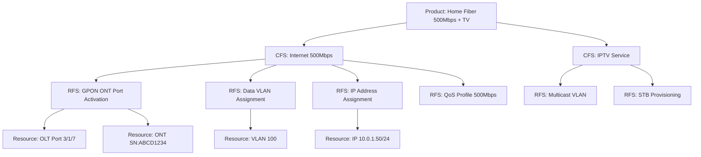
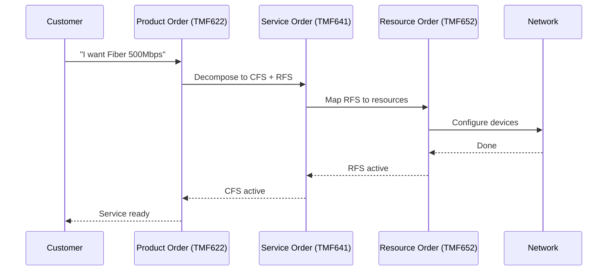

# CFS, RFS, Catalogs & Inventories

## Definition

The **PSR model** (Product → Service → Resource) is TM Forum's layered data architecture that decouples what you sell (products) from what you deliver (services) from what you operate (resources). CFS and RFS are the service layer — the bridge between commercial offers and network infrastructure.

---

## The Four Key Concepts

| Concept | What It Is | Analogy |
|---------|-----------|---------|
| **CFS** (Customer Facing Service) | What the customer experiences | "I have 500Mbps internet" |
| **RFS** (Resource Facing Service) | What the network does to deliver it | "GPON port active, VLAN assigned, QoS applied" |
| **Catalog** | Menu of what CAN exist (specifications, templates) | Restaurant menu |
| **Inventory** | What DOES exist right now (active instances) | Orders currently being served |

---

## CFS — Customer Facing Service

| Aspect | Detail |
|--------|--------|
| **Perspective** | Customer/business view |
| **Technology** | Technology-agnostic (doesn't say HOW) |
| **Reusability** | Same CFS can be delivered over FTTH, HFC, or wireless |
| **Lifecycle** | Tied to the product/customer subscription |
| **Examples** | "Internet 500Mbps", "VoIP Line", "IPTV HD", "MPLS VPN" |

A CFS answers: **"What does the customer get?"**

---

## RFS — Resource Facing Service

| Aspect | Detail |
|--------|--------|
| **Perspective** | Technical/network view |
| **Technology** | Technology-specific (says exactly HOW) |
| **Domain** | Specific to a network domain (IP, GPON, RAN, transport) |
| **Lifecycle** | Tied to network resources |
| **Examples** | "GPON ONT Port Config", "VLAN 100 Assignment", "BGP Peer Session", "5G QoS Flow" |

An RFS answers: **"What does the network do to deliver it?"**

---

## The Decomposition: CFS → RFS → Resources

### Decomposition Rules
- 1 Product → 1 or more CFS
- 1 CFS → 1 or more RFS (via decomposition rules)
- 1 RFS → 1 or more Resources (via mapping)
- Rules are defined in the **Service Catalog**

---

## Catalog vs. Inventory

| | Catalog | Inventory |
|--|---------|-----------|
| **Contains** | Specifications (templates, what CAN exist) | Instances (what DOES exist right now) |
| **Analogy** | Menu | Active orders |
| **Changes** | When you design new services | When you provision/decommission |
| **Used by** | Design time, ordering | Runtime, operations, assurance |

### The Four Combinations

| Layer | Catalog (Specs) | Inventory (Instances) |
|-------|----------------|----------------------|
| **Product** | Product Catalog (TMF620) — offerings, pricing | Product Inventory (TMF637) — active subscriptions |
| **Service** | Service Catalog (TMF633) — CFS/RFS specs | Service Inventory (TMF638) — active CFS/RFS instances |
| **Resource** | Resource Catalog (TMF634) — device types, capabilities | Resource Inventory (TMF639) — actual devices, ports, links |

---

## TM Forum Open APIs

| API ID | Name | What It Manages |
|--------|------|-----------------|
| **TMF620** | Product Catalog Management | Product offerings, specs, pricing |
| **TMF633** | Service Catalog Management | Service specifications (CFS/RFS templates) |
| **TMF634** | Resource Catalog Management | Resource types and capabilities |
| **TMF637** | Product Inventory Management | Active product instances per customer |
| **TMF638** | Service Inventory Management | Active CFS/RFS instances + mappings |
| **TMF639** | Resource Inventory Management | Actual network resources |
| **TMF641** | Service Order Management | Orchestrate service provisioning |
| **TMF652** | Resource Order Management | Orchestrate resource provisioning |

---

## TM Forum ODA Components

| Component | Responsibility |
|-----------|---------------|
| **TMFC001** | Product Catalog Management |
| **TMFC002** | Product Inventory |
| **TMFC006** | Service Catalog Management |
| **TMFC008** | Service Inventory (CFS + RFS + mappings) |
| **TMFC010** | Resource Catalog |
| **TMFC012** | Resource Inventory |

---

## Why This Matters for Autonomous Networks

Without proper CFS/RFS modeling, autonomous networks cannot:

| Capability | Why CFS/RFS Is Needed |
|-----------|----------------------|
| **Impact analysis** | "This fiber cut affects RFS X, which supports CFS Y, which serves Customer Z" |
| **Self-healing** | Know which alternative RFS can fulfill the same CFS |
| **Intent translation** | Decompose "give customer 1Gbps" into specific RFS actions |
| **Root cause analysis** | Trace from customer complaint → CFS → RFS → resource → fault |
| **Automated provisioning** | Catalog rules drive zero-touch service activation |
| **SLA monitoring** | Map SLA (on CFS) to actual performance (on resources) |

---

## Multi-Technology Examples

| Network Type | CFS Example | RFS Example | Resource Example |
|-------------|-------------|-------------|------------------|
| **FTTH** | Broadband 1Gbps | GPON ONT Config | OLT port, ONT, fiber |
| **HFC** | Cable Internet 300Mbps | DOCSIS CM Profile | CMTS, cable modem |
| **Mobile** | 5G Data Plan | Cell Activation + QoS Flow | gNodeB, spectrum, core UPF |
| **Transport** | MPLS VPN | LSP Configuration | Router interfaces, optical transponder |
| **SD-WAN** | Enterprise WAN | Tunnel + Policy Config | CPE, vEdge, SD-WAN controller |
| **VoIP** | Phone Line | SIP Registration | SBC, IMS core |
| **IoT** | Fleet Tracking | Connectivity Profile | SIM, APN config, device |

---

## The Ordering Flow

---

## Common Problems in Real Telcos

| Problem | Impact | Solution |
|---------|--------|----------|
| No CFS/RFS separation | Can't correlate customer impact with network faults | Model services in two layers |
| Stale inventory | AI makes wrong decisions based on outdated data | Data Steward Agent for reconciliation |
| Missing relationships | Can't trace service → resource dependencies | Graph-based inventory |
| Catalog not maintained | New services can't be automated | Treat catalog as code |
| Siloed per domain | No end-to-end view | Unified service inventory (TMFC008) |

---

## Relationship to Other Concepts

| Concept | Connection |
|---------|-----------|
| [ODA](./06-Open-Digital-Architecture-ODA.md) | ODA Components manage catalogs and inventories |
| [Digital Twin](./05-Digital-Twin.md) | CFS/RFS topology is a layer within the digital twin |
| [Knowledge Graph](./07-Knowledge-Graph.md) | CFS→RFS→Resource chains are graph paths |
| [Intent-Based Management](./04-Intent-Based-Management.md) | Intent decomposes through CFS/RFS rules |
| [Data Fabric](../use-cases/08-Data-Mesh-Fabric-Unified-Knowledge-Layer.md) | Catalogs/inventories are key data products in the fabric |
| [Zero Wait](./01-Zero-X.md) | Automated catalog-driven provisioning enables instant delivery |

---

## Sources
- [TM Forum: TMFC008 Service Inventory](https://www.tmforum.org/oda/directory/components-map/production/TMFC008)
- [TM Forum: TMFC006 Service Catalog Management](https://www.tmforum.org/resources/technical-specification/tmfc006-service-catalog-management-v1-1-0/)
- [TM Forum: TMF639 Resource Inventory API v5.0](https://www.tmforum.org/oda/open-apis/directory/resource-inventory-management-api-TMF639/v5.0)
- [TM Forum: TMF620 Product Catalog API](https://www.tmforum.org/oda/open-apis/directory/product-catalog-management-api-TMF620/v4.1.0)
- [Oracle: PSR Models — CFS/RFS Design](https://docs.oracle.com/en/industries/communications/service-catalog-design/8.3/users-guide/defining-your-psr-models1.html)
- [PassionateAboutOSS: Differences Between CFS and RFS](https://passionateaboutoss.com/differences-between-cfs-and-rfs/)
- [TM Forum: Information Framework (SID)](https://www.tmforum.org/oda/information-systems/information-framework-sid/)
