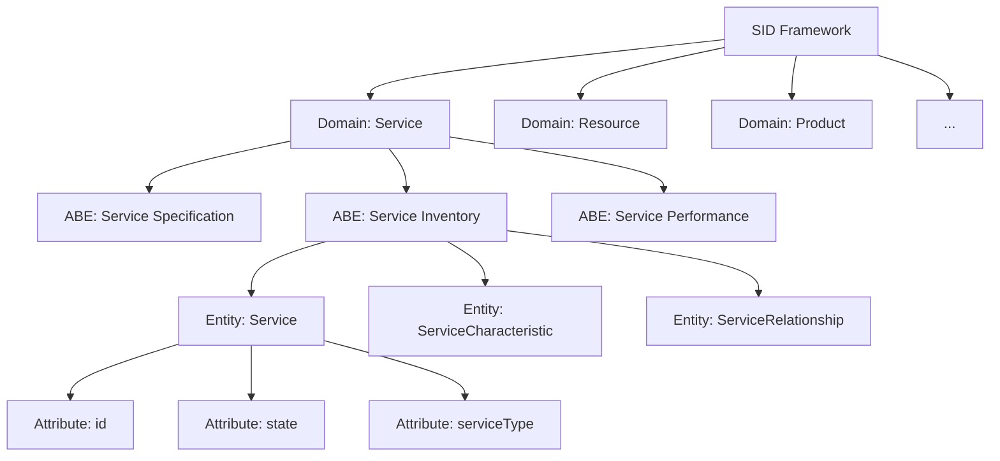

# SID — Information Framework (Shared Information/Data Model)

## Definition

SID (originally "Shared Information/Data Model") is TM Forum's standardized **information and data reference model**. It provides a common vocabulary and entity structure for the entire telecom business — independent of platform, language, or protocol. It's the "language" that all TM Forum frameworks speak.

---

## Why SID Exists

Every telco has the same problem: different systems (BSS, OSS, CRM, NMS) use different names and structures for the same things. SID solves this by defining:

- **What entities exist** (Customer, Service, Resource, Product, etc.)
- **What attributes they have** (name, status, type, etc.)
- **How they relate to each other** (Customer HAS Product, Product USES Service, etc.)

Without SID, integration between systems requires custom mapping for every pair. With SID, everyone speaks the same language.

---

## SID Domains

SID organizes all telecom information into **8 major domains**:

| Domain | What It Covers | Examples |
|--------|---------------|----------|
| **Market/Sales** | Customers, competitors, market segments | Customer, Contact, Account |
| **Product** | What you sell | ProductOffering, ProductSpecification |
| **Service** | What you deliver | ServiceSpecification, CFS, RFS |
| **Resource** | What you operate | PhysicalResource, LogicalResource, Network |
| **Engaged Party** | Who's involved | Individual, Organization, Partner |
| **Enterprise** | Internal operations | Process, Policy, Location |
| **Common Business** | Shared concepts | Address, Money, TimePeriod, Quantity |
| **Metrics** | Measurements | KPI, KQI, Metric Definition |

---

## Structure: Domains → ABEs → Entities → Attributes

| Level | What It Is | Example |
|-------|-----------|---------|
| **Domain** | Major business area | Service |
| **ABE** (Aggregate Business Entity) | Group of related entities | Service Inventory |
| **Entity** | A specific business object | Service |
| **Attribute** | Property of an entity | service.state = "active" |
| **Relationship** | How entities connect | Service USES Resource |

---

## Key Entities (Most Referenced)

| Entity | Domain | What It Represents |
|--------|--------|-------------------|
| **Customer** | Market/Sales | A person or org that buys services |
| **ProductOffering** | Product | Something available for sale |
| **ProductOrder** | Product | A request to buy something |
| **Service** | Service | An active CFS or RFS instance |
| **ServiceSpecification** | Service | Template for a service type |
| **Resource** | Resource | A physical or logical network element |
| **PhysicalResource** | Resource | Router, OLT, antenna, fiber |
| **LogicalResource** | Resource | VLAN, IP address, port, VNF |
| **Party** | Engaged Party | Any individual or organization |
| **Location** | Common | Geographic or logical place |

---

## SID and Open APIs

TM Forum's Open APIs are **based on SID entities**. The API data models map directly to SID:

| API | SID Domain | Key SID Entities Used |
|-----|-----------|----------------------|
| TMF620 (Product Catalog) | Product | ProductOffering, ProductSpecification |
| TMF637 (Product Inventory) | Product | Product (instance) |
| TMF633 (Service Catalog) | Service | ServiceSpecification |
| TMF638 (Service Inventory) | Service | Service, ServiceCharacteristic |
| TMF639 (Resource Inventory) | Resource | Resource, PhysicalResource, LogicalResource |
| TMF632 (Party Management) | Engaged Party | Individual, Organization |

This means: if you understand SID, you understand the API data models.

---

## SID as Ontology for AI

In the context of autonomous networks, SID serves as the **ontology** (formal vocabulary) for:

- **Knowledge graphs** — SID entities become nodes, SID relationships become edges
- **Digital twins** — SID defines what the twin models
- **Data fabric** — SID provides the semantic layer (common meaning)
- **AI agents** — SID gives agents a shared understanding of network objects
- **Intent translation** — SID maps business concepts to technical resources

---

## SID Versions

| Version | Status |
|---------|--------|
| v24.5 | Current production release |
| v23.0 | Previous production |
| GB922 | Document series identifier |

SID is maintained as a UML model and published in multiple formats (UML, HTML, Excel, PNG).

---

## Relationship to Other Concepts

| Concept | Connection |
|---------|-----------|
| [[06-Open-Digital-Architecture-ODA\|ODA]] | SID is the data model underlying all ODA components |
| [[11-CFS-RFS-Catalog-Inventory\|CFS/RFS/Catalog/Inventory]] | These are SID entities in the Service and Resource domains |
| [[06-Open-Digital-Architecture-ODA\|Open APIs]] | API data models are derived from SID |
| [[07-Knowledge-Graph\|Knowledge Graph]] | SID provides the ontology for the graph |
| [[05-Digital-Twin\|Digital Twin]] | SID defines what entities the twin contains |
| [[08-Data-Mesh-Fabric-Unified-Knowledge-Layer\|Data Fabric]] | SID is the semantic standard for the fabric |
| eTOM (Process Framework) | SID entities are the data that eTOM processes operate on |

---

## Practical Value

| Without SID | With SID |
|-------------|----------|
| Every integration is custom mapping | Standard vocabulary across all systems |
| "What does 'service' mean?" varies by team | One definition, shared by all |
| AI models need custom feature engineering | AI can use standard entity/relationship structure |
| Vendor lock-in (proprietary data models) | Vendor-neutral, interoperable |
| Months to integrate new system | Weeks (if both speak SID) |

---

## Sources
- [TM Forum: Information Framework (SID)](https://www.tmforum.org/oda/information-systems/information-framework-sid/)
- [TM Forum: SID Overview Page](https://www.tmforum.org/information-framework-sid/)
- [TM Forum: GB922 Getting Started with Information Framework](https://www.tmforum.org/resources/suite/gb922-getting-started-with-information-framework-v19-5-2/)
- [TM Forum: SID Poster v23.0](https://www.tmforum.org/resources/posters/information-framework-sid-poster-r18-5/)
- [TM Forum: SID Excel Format v23.0](https://www.tmforum.org/resources/reference/information-framework-sid-excel-format-v23-0-0/)
- [TM Forum: SID Training — Fundamentals](https://www.tmforum.org/training-certification/course-information-pages-on-site/information-framework-fundamentals-on-site/)
