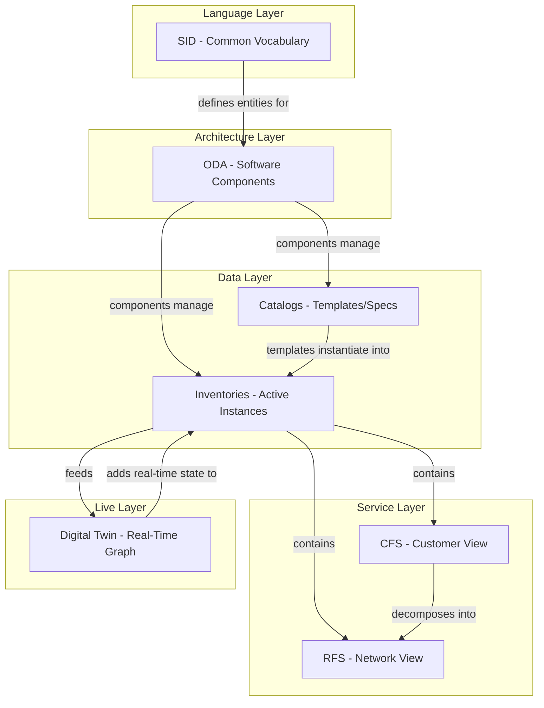

# One View, All Layers — How SID, ODA, CFS, RFS, Catalog, Inventory & Digital Twin Fit Together

## The Big Picture

These aren't competing concepts. They're **layers of the same system**, each solving a different question:

| Concept | Question It Answers | Analogy |
|---------|-------------------|---------|
| **SID** | "What do we call things and how do they relate?" | The dictionary |
| **ODA** | "What software components exist and how do they interact?" | The org chart |
| **Catalog** | "What services/products/resources are available?" | The restaurant menu |
| **Inventory** | "What's actually deployed and active right now?" | The orders being served |
| **CFS** | "What does the customer get?" | "Your table is ready" |
| **RFS** | "What does the network do to deliver it?" | "Chef is cooking your steak" |
| **Digital Twin** | "What's happening in the network RIGHT NOW?" | Live kitchen camera |

---

## How They Stack



---

## The Chain (Step by Step)

```
SID defines    --> what a "Service" IS (entity, attributes, relationships)
ODA defines    --> which Component manages services (TMFC008 = Service Inventory)
Catalog stores --> the TEMPLATE for "Internet 500Mbps" (ServiceSpecification)
Inventory stores --> the ACTIVE instance "Customer Juan has Internet 500Mbps"
CFS is         --> that active instance from the customer's perspective
RFS is         --> the technical decomposition (GPON config, VLAN, QoS)
Digital Twin is --> all of the above, LIVE, as a graph, with real-time metrics
```

---

## Concrete Example: Customer Orders "Fiber 500Mbps"

| Step | Layer | What Happens |
|------|-------|-------------|
| 1 | **SID** | Defines that a Service has id, state, type, characteristics, and relates to Resources |
| 2 | **ODA** | TMFC006 (Service Catalog) holds the spec; TMFC008 (Service Inventory) will hold the instance |
| 3 | **Catalog** | Contains ServiceSpecification "Internet_500Mbps" with decomposition rules |
| 4 | **CFS** | Instance created: "Internet Access 500Mbps" for this customer |
| 5 | **RFS** | Instances created: GPON port activation + VLAN assignment + QoS profile |
| 6 | **Inventory** | Stores all CFS/RFS instances with their relationships and resource mappings |
| 7 | **Digital Twin** | Reflects the new service path through the network graph with live performance data |

---

## Relationships Matrix

| | SID | ODA | Catalog | Inventory | CFS | RFS | Digital Twin |
|--|-----|-----|---------|-----------|-----|-----|-------------|
| **SID** | — | Provides data model | Defines spec structure | Defines instance structure | Is a SID entity | Is a SID entity | Provides ontology |
| **ODA** | Uses SID vocabulary | — | Managed by components | Managed by components | Stored in TMFC008 | Stored in TMFC008 | Consumed by AI components |
| **Catalog** | Written in SID | Lives in ODA components | — | Templates for instances | CFS specs live here | RFS specs live here | Provides "what should exist" |
| **Inventory** | Written in SID | Lives in ODA components | Instantiated from catalog | — | CFS instances live here | RFS instances live here | Provides "what does exist" |
| **CFS** | Defined by SID | Managed by TMFC008 | Spec in Service Catalog | Instance in Service Inventory | — | Decomposes into RFS | A node in the twin |
| **RFS** | Defined by SID | Managed by TMFC008 | Spec in Service Catalog | Instance in Service Inventory | Fulfills a CFS | — | A node in the twin |
| **Digital Twin** | Uses SID as ontology | Feeds AI/ODA components | Validates against catalog | Built from inventory | Contains CFS topology | Contains RFS topology | — |

---

## Key Insight: They're Nested, Not Alternatives

- **SID** is the **language** everything is written in
- **ODA** is the **architecture** that organizes the software
- **Catalogs** and **Inventories** are **data stores** within ODA components
- **CFS/RFS** are **specific SID entities** stored in those inventories
- **Digital Twin** is the **live, graph-based view** of all inventories combined with real-time telemetry

Without SID → you can't define CFS/RFS consistently
Without ODA → you don't know which component manages what
Without Catalogs → you can't automate provisioning
Without Inventories → you don't know what exists
Without CFS/RFS separation → you can't correlate customer impact with network faults
Without Digital Twin → AI can't reason about the network

---

## For Autonomous Networks: All Layers Must Work Together

| AN Capability | Requires |
|--------------|----------|
| **Self-healing** | Digital Twin (detect) + Inventory (know what exists) + RFS (know what to fix) |
| **Zero-touch provisioning** | Catalog (rules) + CFS/RFS decomposition + ODA orchestration |
| **Impact analysis** | Digital Twin graph + CFS→RFS→Resource chain |
| **Intent translation** | SID vocabulary + Catalog decomposition rules + ODA components |
| **Predictive maintenance** | Digital Twin (real-time state) + historical Inventory data |
| **Root cause analysis** | Knowledge Graph (from Digital Twin) + RFS→Resource mappings |

---

## Related Documents

- [[12-SID-Information-Framework|SID — Information Framework]]
- [[06-Open-Digital-Architecture-ODA|ODA — Open Digital Architecture]]
- [[11-CFS-RFS-Catalog-Inventory|CFS, RFS, Catalogs & Inventories]]
- [[05-Digital-Twin|Digital Twin]]
- [[07-Knowledge-Graph|Knowledge Graph]]
- [[04-Intent-Based-Management|Intent-Based Management]]
