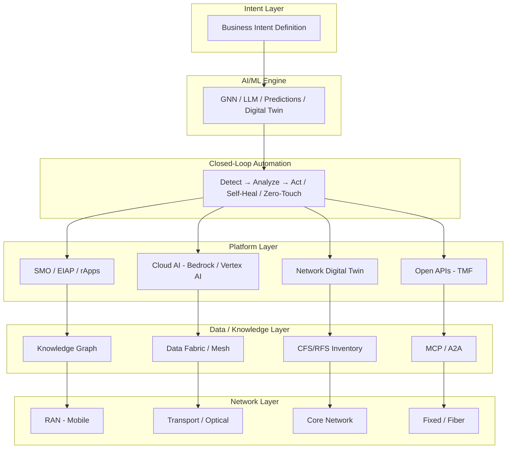

# Autonomous Networks — Use Cases & Architectures (Theory to Practice)

Real-world deployments, reference architectures, and data foundations for Autonomous Networks. Covers multiple operators, cloud platforms, and network domains.

---

## Use Cases Documented

### Operator Deployments (MasOrange — Spain, L4 Certified)

| # | Use Case | Key Technology | Status |
|---|----------|---------------|--------|
| 01 | [[01-GraphML-AIOps-Root-Cause-Analysis\|GraphML-Powered AIOps & Root Cause Analysis]] | Google Cloud + NetAI + GNN + Digital Twin | PoC demonstrated at MWC 2026 |
| 02 | [[02-RAN-Automation-EIAP-rApps\|RAN Automation with Ericsson EIAP & rApps]] | Ericsson EIAP + SMO + rApps | Production (Dec 2025) |
| 03 | [[03-AI-Centric-Transmission-Network\|AI-Centric Transmission Network]] | AI/ML + Intent-Based Orchestration | Production (2025–2026) |
| 04 | [[04-TM-Forum-Level4-Certification\|TM Forum Level 4 Certification]] | Full AN architecture | Certified May 2026 |

### AWS-Based Deployments & Architectures

| # | Use Case | Key Technology | Status |
|---|----------|---------------|--------|
| 05 | [[05-AWS-Agentic-rApp-as-a-Service\|Ericsson Agentic rApp as a Service on AWS]] | AWS Bedrock + SageMaker + Ericsson EIAP | Production (60+ CSPs) |
| 06 | [[06-AWS-Multi-Agent-Network-Operations\|AWS Multi-Agent Network Operations]] | Amazon Bedrock Agents + Nova + Lambda | Open-source reference architecture |

### Data Architecture & Foundations

| # | Use Case | Key Technology | Status |
|---|----------|---------------|--------|
| 07 | [[07-Data-Model-CFS-RFS-Catalog-for-AN\|Data Model: CFS/RFS/Catalog for AN]] | TM Forum PSR + Graph DB + Digital Twin | Architecture guidance |
| 08 | [[08-Data-Mesh-Fabric-Unified-Knowledge-Layer\|Data Mesh/Fabric & Unified Knowledge Layer]] | Data Mesh + Knowledge Graph + MCP + Federated Governance | Industry convergence (2025–2026) |

---

## Generic Architecture (Autonomous Network Stack)

---

## Key Technology Partners

| Partner | Role |
|---------|------|
| **Ericsson** | EIAP, SMO, rApps, 5G Core, Telco DataOps |
| **Google Cloud** | Spanner Graph, Vertex AI, tf-GNN, Telecom Data Fabric |
| **AWS** | Bedrock, SageMaker, rApp aaS, Multi-Agent framework, MCP |
| **NetAI** | GraphML-based AIOps, GNN fine-tuning |
| **TM Forum** | Standards, certification (ANLET), Open APIs, SID ontology |

---

## Key Questions Answered

### Are Autonomous Networks only about mobile?
**No.** AN applies to ALL network domains:
- **Fixed broadband / Fiber (FTTH)** — TM Forum Catalyst C25.0.777 specifically targets fiber
- **Transport / Optical** — AI-centric transmission networks (MasOrange, others)
- **Core Network** — NEC demonstrated autonomous UPF orchestration on AWS
- **Enterprise / SD-WAN** — B2B service automation
- **IoT** — Device management at scale

### Is there a working case on AWS?
**Yes, multiple:**
1. **Ericsson rApp aaS** — Production SaaS on AWS Marketplace (60+ CSPs, 13M sites)
2. **BT Group** — Self-healing 5G SA network with AWS agentic AI (30M subscribers)
3. **Telkomsel CELYNA** — GenAI incident analysis with Amazon Nova Pro (production)
4. **NEC** — Autonomous UPF orchestration demonstrated at MWC 2026
5. **AWS Multi-Agent NOC** — Open-source reference architecture on GitHub

### How to handle inventory, RFS, CFS, Catalog for AN?
See **[[07-Data-Model-CFS-RFS-Catalog-for-AN|Document 07]]**. Key points:
- TM Forum's PSR (Product-Service-Resource) model is the standard
- CFS = technology-agnostic customer view; RFS = technology-specific network view
- Graph databases are essential for topology-aware AI
- A "Data Steward Agent" can automate inventory reconciliation
- Transformation is phased: Reconcile → Model → Graph → Digital Twin

### How to avoid building tons of integrations?
See **[[08-Data-Mesh-Fabric-Unified-Knowledge-Layer|Document 08]]**. Key points:
- Data Mesh / Data Fabric patterns — data stays where it is, semantic layer unifies access
- Knowledge Graphs as the backbone (relationships are first-class citizens)
- Standardized protocols (MCP, A2A, Open APIs) replace point-to-point connections
- Edge SLMs filter/classify data at the source
- TM Forum's Modern Data Architecture Project (IG1356) formalizes this for telco

---

## Operators Referenced

| Operator | Country | Key Achievement |
|----------|---------|-----------------|
| **MasOrange** | Spain | First in Spain to achieve TM Forum L4 certification (May 2026) |
| **BT Group** | UK | Self-healing 5G SA with AWS agentic AI |
| **Telkomsel** | Indonesia | GenAI incident analysis (CELYNA) on AWS |
| **Ooredoo Kuwait** | Kuwait | TM Forum L4 certification (2025) |
| **Deutsche Telekom** | Germany | Autonomous operations with Google Cloud |
| **Vodafone** | Global | AI-driven network management |
| **One NZ** | New Zealand | Autonomous network agents (Google Cloud) |

---

## Sources
- [Google Cloud: Autonomous Networks at MWC 2026](https://cloud.google.com/blog/topics/telecommunications/autonomous-networks-at-mwc-2026)
- [AWS: Agentic AI for RAN Optimization](https://aws.amazon.com/blogs/industries/agentic-ai-for-ran-optimization-pathway-to-autonomous-network-level-5/)
- [Ericsson: MasOrange EIAP](https://www.ericsson.com/en/press-releases/3/2025/ericsson-and-masorange-advance-autonomous-networks-with-ai-driven-automation-platform-and-rapps)
- [TM Forum: Modern Data Architecture](https://www.tmforum.org/modern-data-architecture-project/)
- [TM Forum: Autonomous Networks Project](https://www.tmforum.org/autonomous-networks-project/)
